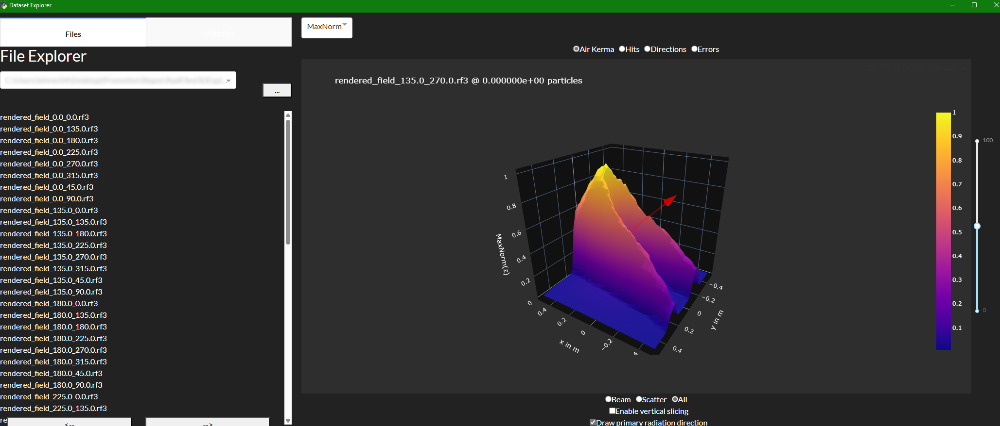

# RadFiled3DExplorer
Simple Dataset Visualization Application for a folder of [RadFiled3D](https://github.com/Centrasis/RadFiled3D) Files. This application allows the exploration of a single folder of radiation fields that are created by the [RadField3D](https://github.com/Centrasis/RadField3DSimulation) simulation software.

# Getting Started
Just install this python module by cloning this repository and calling ``pip install .`` from the repository root.

Now you can execute this module by calling ``python -m RadFiled3DExplorer`` from the directory you want to display your .rf3 files stored with RadFiled3D. Currently, cartesian and polar fields are supported, but the primary beam direction can only be rendered for cartesian fields.

# Example
When the GUI was successfully installed, you should be able to browse your dataset like this:

# Expected field structure
The exporer is designed to display radiations fields consisting of two channels: `scatter_field` (secondary field) and `xray_beam` (pimary field). In each channel there shall be at least two layers: `hits` (relative hits count per primary equals the volumetric fluence) and `spectrum` the normalized photon spectrum per voxel. Optionally, there can be the layer `direction` which should contain 3D vectors (RadField3D.vec3) to store the voxelwise principal direction of the photons and the layer `error` which should contain the relative error per voxel between 0 and 1.

| Channel       | Layer      | Description                                                                 |
|---------------|------------|-----------------------------------------------------------------------------|
| scatter_field | hits       | Relative hits count per primary equals the volumetric fluence               |
|               | spectrum   | Normalized photon spectrum per voxel                                        |
|               | direction  | (Optional) 3D vectors (RadField3D.vec3) to store the voxelwise principal direction of the photons |
|               | error      | (Optional) Relative error per voxel between 0 and 1                         |
| xray_beam     | hits       | Relative hits count per primary equals the volumetric fluence               |
|               | spectrum   | Normalized photon spectrum per voxel                                        |
|               | direction  | (Optional) 3D vectors (RadField3D.vec3) to store the voxelwise principal direction of the photons |
|               | error      | (Optional) Relative error per voxel between 0 and 1                         |